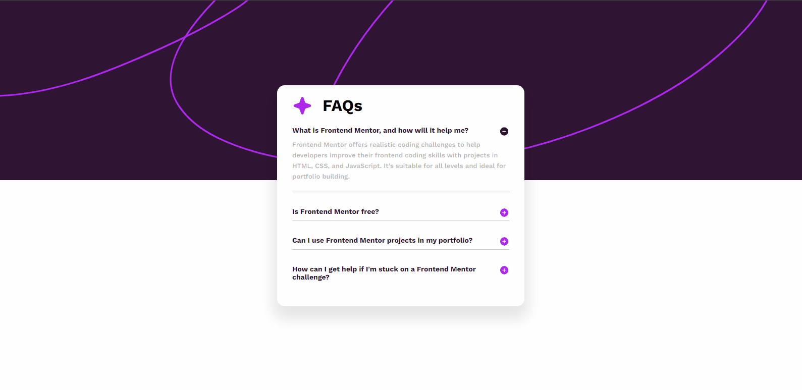

# Frontend Mentor - FAQ accordion

Um desafio do Frontend Mentor onde os usuários são capazes de Ocultar/Mostrar a resposta a uma pergunta quando a pergunta é clicada

## Tecnologias utilizadas

- Html
- Css
- JavaScript
